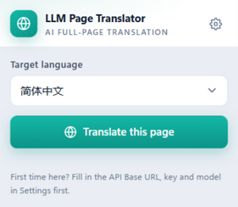
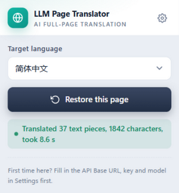
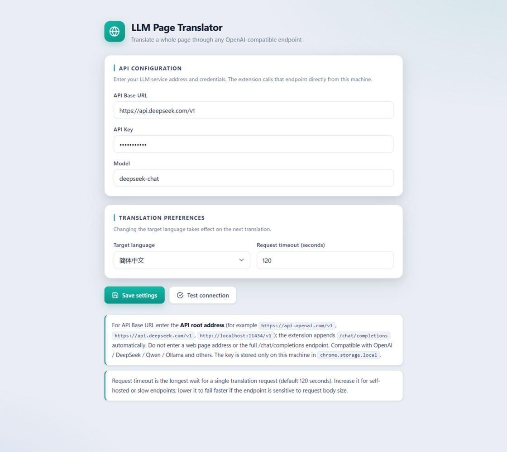

**English** | [简体中文](README.zh-CN.md)

# LLM Page Translator (Chrome MV3)

A Chrome Manifest V3 extension that translates **all readable text on the current page** — body copy, navigation, button labels, and the `placeholder` / `title` / `aria-label` / `alt` attributes — into a target language using **any OpenAI-compatible LLM API**. Click once to translate, click again to restore the original. Content loaded by infinite scroll or an SPA is translated automatically as it appears.

No translation-service subscription required: you only need an endpoint that speaks OpenAI's `POST /chat/completions` — OpenAI, DeepSeek, Ollama, vLLM, or any compatible gateway.

---

## Features

- **Whole-page translation** — body text nodes plus four text-bearing attributes (`placeholder` / `title` / `aria-label` / `alt`)
- **One-click toggle** — a single button switches between "Translate this page" and "Restore this page" based on the page's current state
- **Streamed rendering** — text is translated in batches, and each batch is written to the page as soon as it arrives instead of waiting for all batches
- **Dynamic back-fill** — a `MutationObserver` watches for newly added nodes and attributes rewritten by the site, then back-fills after a debounce (handles infinite scroll and SPA route changes)
- **Safe restore** — the original value of every node is recorded and written back precisely; nodes rewritten by the site are detected by a reconciliation pass and re-translated
- **Caching per target language** — identical source text is never requested twice, so repeated content costs nothing
- **Concurrent requests** — batches run concurrently (3 by default), cutting total wall-clock time versus serial requests
- **Localized UI** — 18 UI languages with copy kept out of the code; the target language is inferred from the browser UI language on first use
- **No hard-coded secrets** — the API key lives only in local `chrome.storage.local` and is sent only to the Base URL you configure

---

## Screenshots

Toolbar panel — before and after translation:

| Not translated | Translated |
| --- | --- |
|  |  |

Options page:



<sub>These screenshots are rendered from the extension's real HTML/CSS/JS with an English UI. The actual interface follows your browser language, and one of 18 languages is used accordingly.</sub>

---

## Installation (developer mode)

1. Open `chrome://extensions`
2. Toggle **Developer mode** on (top right)
3. Click **Load unpacked** and select the repository root
4. Pinning the extension icon to the toolbar is recommended

---

## Configuration

Open the options page by any of these routes:

- Click the toolbar icon → the **⚙ Settings** button in the panel
- Right-click the toolbar icon → **Options**
- `chrome://extensions` → this extension → **Extension options**

Fill in the fields and click **Save**:

| Field | Description |
| --- | --- |
| **API Base URL** | API root, e.g. `https://api.openai.com/v1`. DeepSeek: `https://api.deepseek.com/v1`; Ollama: `http://localhost:11434/v1`. A value already ending in `/chat/completions` is not appended to again |
| **API Key** | The key for that service |
| **Model** | Model name, e.g. `gpt-4o-mini` |
| **Target language** | Destination language. On first use it is inferred from the browser UI language (a German UI defaults to German), falling back to English; once you pick one manually, it sticks |
| **Request timeout (seconds)** | Maximum wait for a single translation request, **120 seconds** by default. Test connection also honors this value |

Click **Test connection** to verify connectivity; on success it echoes a sample translation.

> **Note**: Test connection sends only a single very short line, so a passing test does **not** guarantee real translations will succeed. A real translation sends batched text (≤ 8 items / 400 characters per batch by default, 3 batches concurrently); with a slow endpoint or one sensitive to request-body size, you may see "test passes but translation times out." In that case raise **Request timeout** or switch to a faster model/endpoint.

### Switching languages from the panel

The toolbar panel has its own **target language** dropdown (18 languages). Changing it saves immediately and takes effect on the next translation, so you never have to open the options page. The panel and options page share one language list, so the choices always match.

---

## Usage

1. Open any web page and click the toolbar icon to open the panel
2. Click **Translate this page**; translations stream onto the page batch by batch
3. Click **Restore this page** (the label switches automatically) to restore the original text

**Page state and messages**:

- Opening the panel queries the current page's state, and both the button label and the status line follow that state
- If the page language already matches the target language, translation is skipped and the panel shows "already in target language" — this does not count as a translation
- Clicking while a translation is in flight reports "translation in progress" instead of starting a second run
- When translation finishes, the status line shows `Translated N items, X characters, in Y seconds` (characters are source-text characters; time includes accumulated dynamic back-fill)
- If some batches fail, the partial result is shown and the untranslated nodes can be back-filled in a later round or retried with another click
- If the page was already open before the extension was installed, the first click injects the content script and runs, so it never appears unresponsive

---

## How it works

```
┌──────────┐  TOGGLE_TAB / GET_STATE   ┌────────────────┐
│  popup   │ ────────────────────────▶ │ service worker │
└──────────┘                           └────────────────┘
                                            │  ▲
                        TOGGLE / GET_STATE  │  │  RESULT_BATCH (streamed, once per batch)
                                            ▼  │
                                      ┌──────────────┐
                                      │content script│ ── collect → batch → LLM
                                      └──────────────┘        ↑            │
                                                              └─ apply ◀───┘
```

1. **Collect** — the content script walks text nodes with a `TreeWalker` and scans `placeholder` / `title` / `aria-label` / `alt`; a `WeakMap` records "already skipped" markers to avoid re-translating
2. **Batch** — after de-duplication, items are split at **8 items / 400 characters** and sent as **3 concurrent batches**
3. **Request** — the service worker submits a JSON object shaped `{ "0": "text", "1": "…" }` and requires the model to return JSON with the same keys; a 120s timeout and retries apply
4. **Render** — each finished batch is pushed to the page via `RESULT_BATCH` and written to the cache; the DOM applies records deduplicated by id
5. **Back-fill** — the `MutationObserver` debounces 500ms, collects changed nodes, and re-translates only the new or rewritten ones

### Page state machine

The page keeps three states rather than a simple boolean — "skipped because same language" must be distinct from "translated", or the next click would wrongly enter the restore branch:

| State | Meaning |
| --- | --- |
| `idle` | Not translated |
| `translated` | Translated; the button now means "restore" |
| `skipped-same-language` | Page language matches the target language; skipped |

---

## Cost and reliability

- **De-duplication** — repeated text within a batch is requested once; source text that hits the cache across batches or sessions is read directly
- **Cache** — keyed by "target language + source text" (FNV-1a 64-bit hash) in `chrome.storage.local`
- **Retries** — failures are retried **2 times** with 1s / 2s backoff, **only for transient server-side problems (such as HTTP 5xx)**; timeouts and unreachable networks fail immediately so users don't wait through 3× the timeout
- **Partial success** — when a batch fails permanently, successful batches still return and are cached, so the next click only back-fills what is missing

---

## UI localization

UI copy is not hard-coded. It lives in `_locales/<locale>/messages.json`, and Chrome selects it by **browser UI language**; `en` is the `default_locale`, and any missing key falls back to it.

- 18 UI languages are supported: `en` (default), `zh_CN`, `zh_TW`, `ja`, `ko`, `de`, `fr`, `es`, `it`, `pt`, `ru`, `nl`, `pl`, `tr`, `ar`, `hi`, `vi`, `th`
- The extension name, description, and toolbar tooltip use manifest placeholders such as `__MSG_ext_name__`
- In-page messages and error text all go through `Ext.i18n.t(key, [subs])`; no hard-coded Chinese remains
- Language names in the target-language selector always use the language's own endonym (English / 日本語 / Deutsch…), independent of the UI language
- **Adding a UI language**: copy `_locales/en/messages.json` to `_locales/<locale>/messages.json` and translate the `message` fields. Placeholders `$1` `$2` must be preserved verbatim; `npm test` verifies that every language has the same key set and placeholders

---

## Development

```bash
npm install
npm test        # Vitest + jsdom, 13 test files / 157 cases
```

Coverage includes batch splitting and response parsing, cache hashing, DOM collection and apply/restore reconciliation, observer debouncing, LLM request building and timeouts, service-worker message routing and retries, popup/options state rendering, i18n key completeness, and manifest file existence.

After changing code, click the refresh button on the extension card at `chrome://extensions` to reload; changes to content scripts also require reloading the target page.

### Debug logging

Every LLM request/response is logged to the **Service Worker console**:

- Request: `[LLM Page Translator] → POST <url>` plus the request-body JSON (model, system prompt, text to translate)
- Response: `[LLM Page Translator] ← HTTP <status> <url> (<elapsed>ms)` plus the raw response body (printed for both success and non-2xx)
- Timeouts and network failures additionally log a `✖` warning with the URL and the failure reason

Only the request body is logged, **never the request headers**, so the API key is never leaked.

To view it: `chrome://extensions` → this extension → click **Service Worker** (or "Inspect views" on the card) → Console.

> Logging is always on and its output contains page text; when the service worker sleeps and restarts, console logs are cleared — nothing is written to disk or persisted.

---

## Project structure

```
manifest.json                    MV3 manifest (default_locale + __MSG__ localization)
_locales/<locale>/messages.json  18 UI-language message tables
icons/                           16/32/48/128 extension icons
src/shared/constants.js          message types / page states / default config / batch params / language list / UI-language inference
src/shared/i18n.js               message lookup (t / apply) and data-i18n* DOM filling
src/shared/batch.js              batch splitting + LLM JSON payload building and tolerant parsing
src/shared/cache.js              translation cache (FNV-1a 64-bit keys, pluggable backend)
src/shared/theme.css             shared theme styles for the panel and options page
src/background/llm.js            OpenAI-compatible request building + request/response logging + timeout
src/background/service-worker.js message routing / cache / concurrent batches / retries / content-injection fallback
src/content/detect.js            page language detection and same-language comparison
src/content/collect.js           DOM text-node and attribute collection (skip map to avoid re-translating)
src/content/apply.js             translation application, record reconciliation, and original restore
src/content/observer.js          debounced MutationObserver
src/content/main.js              content orchestration entry (TOGGLE switching + streaming)
src/popup/                       toolbar panel (popup.html / popup.css / popup.js)
src/options/                     options page (options.html / options.css / options.js)
test/                            unit tests (Vitest + jsdom)
docs/superpowers/                design and implementation-plan documents (Chinese)
```

---

## Known limitations

- Content inside `<script>/<style>/<noscript>/<template>/<textarea>/<code>/<pre>/<kbd>/<samp>/<iframe>` is left untranslated
- Clicking the toolbar icon only opens the panel; you must click "Translate this page / Restore this page" there to act
- When the same word appears more than once inside a single text node, only the first occurrence is replaced
- On rare sites whose scripts hold references to the original text, internal state may drift after replacement — click the icon once more to restore
- The cache has no eviction policy (v0.1): `chrome.storage.local` is about 10MB by default, enough for tens of thousands of entries
- Only OpenAI-compatible `/chat/completions` endpoints are supported; other translation protocols are not

---

## Privacy

- The API key is stored only in local `chrome.storage.local` and is never uploaded to any third party
- Text to be translated is sent only to the **Base URL you configure**
- The extension contains no telemetry, analytics, or remote-config fetching
- Permissions used: `storage` (config and cache), `scripting` (inject the content script into already-open pages), and `http/https` host permissions (read and replace page text)

---

## License

This project is released under the [MIT License](LICENSE).
